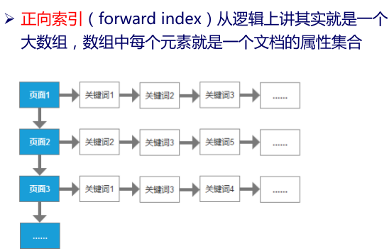
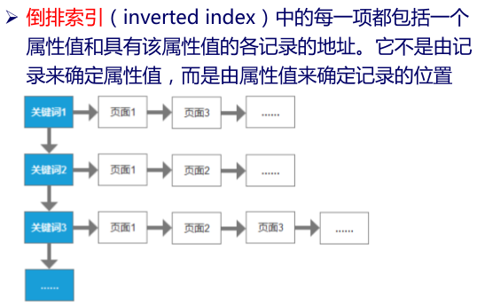

### 前言

不知道为什么GitHub中好像对目录索引支持不够好，下文目录中有的锚点不能跳转，我也没办法。这里我将下文放到了我CSDN的博客上，可以跳转目录，看起来也方便美观一点——[大数据之Hadoop学习——动手实战学习MapReduce编程实例](https://blog.csdn.net/lzw2016/article/details/84928495) 

这里放一个我学习MapReduce的编程实例项目吧，本来是想把这些分开写成多篇文章的，能够详细叙述我学习过程中感想。但无奈，时间不够，只好在Github上创建了该项目，在代码中由较为详细的注释，我想也足够了吧。
[josonle/MapReduce-Demo](https://github.com/josonle/MapReduce-Demo)
该项目有些题目是参考了网上几篇博客，但代码实现是本人实现的。其次，所谓的MapReduce学习流程是参照老师上课所讲的PPT上的流程【某985大数据课程PPT】，我想老师以这样的流程授课肯定是有道理的。项目中也放了老师提供的几个参考Demo文件。

该项目还在更新中，有些代码还没实现，慢慢来吧。

***

## 目录

- [MapReduce编程实例](#MapReduce编程实例)
  + [1.自定义对象序列化](#1.自定义对象序列化)
  + [2.数据去重](#2.数据去重)
  + [3.数据排序、二次排序 ](#3.数据排序、二次排序)
  + [4.自定义分区](#4.自定义分区)
  + [5.计算出每组订单中金额最大的记录](#5.计算出每组订单中金额最大的记录)
  + [多文件输入输出、及不同输入输出格式化类型](#多文件输入输出、及不同输入输出格式化类型)
  	+ [6.合并多个小文件](#6.合并多个小文件（多文件输入输出、及不同输入输出格式化类型）)
  	+ [7.分组输出到多个文件](#7.分组输出到多个文件【多文件输入输出、及不同输入输出格式化类型】)
  + [8.join操作](#8.join操作)
  + [9.计算出用户间的共同好友](#9.**计算出用户间的共同好友**)
- [MapReduce理论基础](#MapReduce理论基础)
- [Hadoop、Spark学习路线及资源收纳](#Hadoop、Spark学习路线及资源收纳)
- [MapReduce实战系统学习流程](#MapReduce实战系统学习流程)
  + [词频统计](#词频统计)
  + [数据去重](#数据去重)
  + [数据排序](#数据排序)
  + [求平均值、中位数、标准差、最大/小值、计数](#求平均值、中位数、标准差、最大/小值、计数)
  + [分组、分区](#分组、分区)
  + [数据输入输出格式化](#数据输入输出格式化)
  + [多文件输入、输出](#多文件输入、输出)
  + [多文件输入、输出](#多文件输入、输出)
  + [单表关联](#单表关联)
  + [多表关联](#多表关联)
  + [倒排索引](#倒排索引)
  + [TopN](#TopN)
  + [作业链](#作业链) 
  + [PeopleRank算法实现](#PeopleRank算法实现)
  + [推荐系统——协同过滤算法实现](#推荐系统——协同过滤算法实现)
- [数据](#数据)
- [关于我](#关于我)

## MapReduce编程实例

### 1.自定义对象序列化

- [【源码 FlowStatistics.java】](https://github.com/josonle/MapReduce-Demo/blob/master/src/main/java/mapreduceProgram/FlowStatistics.java)

#### 需求分析

需要统计手机用户流量日志，日志内容实例： 


要把同一个用户的上行流量、下行流量进行累加，并计算出综合 。例如上面的13897230503有两条记录，就要对这两条记录进行累加，计算总和，得到：13897230503，500，1600，2100

#### 报错：Exception in thread "main" java.lang.IllegalArgumentException: Wrong FS: hdfs://192.168.17.10:9000/workspace/flowStatistics/output, expected: file:///

```
解决：1、将core-site.xml 和hdfs-site.xml拷贝到项目里去就可以，原因是访问远程的HDFS 需要通过URI来获得FileSystem
	2、在项目中，Configuration对象设置fs.defaultFS 【推荐这个,**大小写别拼错，我就是拼错了找了半天**】

		String namenode_ip = "192.168.17.10";
		String hdfs = "hdfs://"+namenode_ip+":9000";
		Configuration conf = new Configuration();
		conf.set("fs.defaultFS", hdfs);
```

#### 解答

##### 一、正常处理即可，不过在处理`500 1400` 这种时灵活变通一下即可

```java
public static class FlowMapper extends Mapper<Object, Text, Text, Text>{
		
		public void map(Object key,Text value,Context context) throws IOException, InterruptedException {
			String[] strs = value.toString().split("\t");
			Text phone = new Text(strs[0]);
			Text flow = new Text(strs[1]+"\t"+strs[2]);
			context.write(phone, flow);
		}
	}
	
	public static class FlowReducer extends Reducer<Text, Text, Text, Text>{
		public void reduce(Text key,Iterable<Text> values,Context context) throws IOException, InterruptedException {
			int upFlow = 0;
			int downFlow = 0;
			
			for (Text value : values) {
				String[] strs = value.toString().split("\t");
				upFlow += Integer.parseInt(strs[0].toString());
				downFlow += Integer.parseInt(strs[1].toString());
			}
			int sumFlow = upFlow+downFlow;
			
			context.write(key,new Text(upFlow+"\t"+downFlow+"\t"+sumFlow));
		}
	}
```
***

##### 二、自定义一个实现Writable接口的可序列化的对象Flow，包含数据形式如 `upFlow downFlow sumFlow`


```java

public static class FlowWritableMapper extends Mapper<Object, Text, Text, FlowWritable> {
		public void map(Object key,Text value,Context context) throws IOException, InterruptedException {
			String[] strs = value.toString().split("\t");
			Text phone = new Text(strs[0]);
			FlowWritable flow = new FlowWritable(Integer.parseInt(strs[1]),Integer.parseInt(strs[2]));
			context.write(phone, flow);
		}
	}
	public static class FlowWritableReducer extends Reducer<Text, FlowWritable, Text, FlowWritable>{
		public void reduce(Text key,Iterable<FlowWritable> values,Context context) throws IOException, InterruptedException {
			int upFlow = 0;
			int downFlow = 0;
			
			for (FlowWritable value : values) {
				upFlow += value.getUpFlow();
				downFlow += value.getDownFlow();
			}
			
			context.write(key,new FlowWritable(upFlow,downFlow));
		}
	}
	
	public static class FlowWritable implements Writable{
		private int upFlow,downFlow,sumFlow;

		public FlowWritable(int upFlow,int downFlow) {
			this.upFlow = upFlow;
			this.downFlow = downFlow;
			this.sumFlow = upFlow+downFlow;
		}
		
		public int getDownFlow() {
			return downFlow;
		}

		public void setDownFlow(int downFlow) {
			this.downFlow = downFlow;
		}

		public int getUpFlow() {
			return upFlow;
		}

		public void setUpFlow(int upFlow) {
			this.upFlow = upFlow;
		}

		public int getSumFlow() {
			return sumFlow;
		}

		public void setSumFlow(int sumFlow) {
			this.sumFlow = sumFlow;
		}
		// writer和readFields方法务必实现，序列化数据的关键
		@Override
		public void write(DataOutput out) throws IOException {
			// TODO Auto-generated method stub
			out.writeInt(upFlow);
			out.writeInt(downFlow);
			out.writeInt(sumFlow);
		}

		@Override
		public void readFields(DataInput in) throws IOException {
			// TODO Auto-generated method stub
			upFlow = in.readInt();
			downFlow = in.readInt();
			sumFlow = in.readInt();
		}

		@Override
		public String toString() {
			// TODO Auto-generated method stub
			return upFlow+"\t"+downFlow+"\t"+sumFlow;
		}
	}
```

**注意：** 要根据具体情况在job中设置Mapper、Reducer类及输出的key、value类型
具体见代码
### 2.数据去重

- [【源码 DateDistinct.java】](https://github.com/josonle/MapReduce-Demo/blob/master/src/main/java/ssdut/training/mapreduce/datecount/DateDistinct.java)

#### 需求分析

需求很简单，就是把文件中重复数据去掉。比如说统计类似如下文件中不包含重复日期数据的日期

```
2017-02-14 1
2016-02-01 2
2017-07-10 3
2016-02-26 4
2015-01-19 5
2016-04-29 6
2016-05-10 7
2015-11-20 8
2017-05-23 9
2014-02-26 10
```

#### 解答思路

只要搞清楚了MR的流程这个就很简单，reducer的输入类似<key3,[v1,v2,v3...]>，这个地方输入的key3是没有重复值的。所以利用这一点，Mapper输出的key保存日期数据，value置为空即可 【**这里可以使用NullWritable**类型】

还有就是，不一定是日期去重，去重一行数据也是如此，key保存这一行数据即可

```java
public static class DateDistinctMapper extends Mapper<Object, Text, Text, NullWritable> {		
		public void map(Object key, Text value, Context context ) 
				throws IOException, InterruptedException {
	    	String[] strs = value.toString().split(" ");
	    	Text date = new Text(strs[0]);//取到日期作为key
			context.write(date, NullWritable.get());
	    }
	}
  
public static class DateDistinctReducer extends Reducer<Text,NullWritable,Text,NullWritable>{
    
		public void reduce(Text key, Iterable<NullWritable> values, Context context) 
				throws IOException, InterruptedException {
			context.write(key, NullWritable.get());
	    }
	}
```


### 3.数据排序、二次排序

- [源码 升序排序 DateSortAsc.java](https://github.com/josonle/MapReduce-Demo/blob/master/src/main/java/mapreduceProgram/DateSortAsc.java)
- [【源码 降序排序 DateSortDesc.java】](https://github.com/josonle/MapReduce-Demo/blob/master/src/main/java/mapreduceProgram/DateSortDesc.java)
- [【源码 二次排序 FlowSort.java】](https://github.com/josonle/MapReduce-Demo/blob/master/src/main/java/mapreduceProgram/FlowSort.java)

#### 需求分析

这一类问题很多，像学生按成绩排序，手机用户流量按上行流量升序，下行流量降序排序等等

1. 日期计数升序排序

2. 日期计数降序排序

   ```
   //日期	日期出现的次数
   2015-01-27	7
   2015-01-28	3
   2015-01-29	7
   2015-01-30	6
   2015-01-31	7
   2015-02-01	15
   2015-02-02	10
   2015-02-03	9
   2015-02-04	12
   2015-02-05	14
   ```

   

3. 手机用户流量按上行流量升序，下行流量降序排序

#### 解答思路

MapReduce是默认会对key进行升序排序的，可以利用这一点实现某些排序

- 单列排序
  - 升序还是降序排序
  - 可以利用Shuffle默认对key排序的规则；
  - 自定义继承WritableComparator的排序类，实现compare方法
- 二次排序
  - 实现可序列化的比较类WritableComparable<T>，并实现compareTo方法（同样可指定升序降序）

##### 日期按计数升序排序

```java
public static class SortMapper extends Mapper<Object, Text, IntWritable, Text> {
		private IntWritable num = new IntWritable();

		public void map(Object key, Text value, Context context) throws IOException, InterruptedException {
			String[] strs = value.toString().split("\t");
			num.set(Integer.parseInt(strs[1]));
			// 将次数作为key进行升序排序
			context.write(num, new Text(strs[0]));
			System.out.println(num.get()+","+strs[0]);
		}
	}

	public static class SortReducer extends Reducer<IntWritable, Text, Text, IntWritable> {

		public void reduce(IntWritable key, Iterable<Text> values, Context context)
				throws IOException, InterruptedException {
			for (Text value : values) {
				// 排序后再次颠倒k-v，将日期作为key
				System.out.println(value.toString()+":"+key.get());
				context.write(value, key);
			}
		}
	}
```

##### 日期按计数降序排序

实现自定义的排序比较器，继承WritableComparator类，并实现其compare方法

```java
public static class MyComparator extends WritableComparator {
		public MyComparator() {
			// TODO Auto-generated constructor stub
			super(IntWritable.class, true);
		}

		@Override
		@SuppressWarnings({ "rawtypes", "unchecked" }) // 不检查类型
		public int compare(WritableComparable a, WritableComparable b) {
			// CompareTo方法，返回值为1则降序，-1则升序
			// 默认是a.compareTo(b)，a比b小返回-1，现在反过来返回1，就变成了降序
			return b.compareTo(a);
	}
```

所使用的Mapper、Reducer同上面升序排序的，其次，要在main函数中指定自定义的排序比较器

`job.setSortComparatorClass(MyComparator.class);`


##### 手机用户流量按上行流量升序，下行流量降序排序

同第一个实例类似，要自定义对象序列化，同时也要可比较，实现WritableComparable接口，并实现CompareTo方法

我这里是将之前统计好的用户流量数据作为输入数据

```java
public static class MySortKey implements WritableComparable<MySortKey> {
		private int upFlow;
		private int downFlow;
		private int sumFlow;

		public void FlowSort(int up, int down) {
			upFlow = up;
			downFlow = down;
			sumFlow = up + down;
		}

		public int getUpFlow() {
			return upFlow;
		}
		public void setUpFlow(int upFlow) {
			this.upFlow = upFlow;
		}
		public int getDownFlow() {
			return downFlow;
		}
		public void setDownFlow(int downFlow) {
			this.downFlow = downFlow;
		}
		public int getSumFlow() {
			return sumFlow;
		}
		public void setSumFlow(int sumFlow) {
			this.sumFlow = sumFlow;
		}

		@Override
		public void write(DataOutput out) throws IOException {
			// TODO Auto-generated method stub
			out.writeInt(upFlow);
			out.writeInt(downFlow);
			out.writeInt(sumFlow);
		}

		@Override
		public void readFields(DataInput in) throws IOException {
			// TODO Auto-generated method stub
			upFlow = in.readInt();
			downFlow = in.readInt();
			sumFlow = in.readInt();
		}

		@Override
		public int compareTo(MySortKey o) {
			if ((this.upFlow - o.upFlow) == 0) {// 上行流量相等，比较下行流量
				return o.downFlow - this.downFlow;// 按downFlow降序排序
			} else {
				return this.upFlow - o.upFlow;// 按upFlow升序排
			}
		}

		@Override
		public String toString() {
			// TODO Auto-generated method stub
			return upFlow + "\t" + downFlow + "\t" + sumFlow;
		}
	}

	public static class SortMapper extends Mapper<Object, Text, MySortKey, Text> {
		Text phone = new Text();
		MySortKey mySortKey = new MySortKey();

		public void map(Object key, Text value, Context context) throws IOException, InterruptedException {
			String[] lists = value.toString().split("\t");
			phone.set(lists[0]);
			mySortKey.setUpFlow(Integer.parseInt(lists[1]));
			mySortKey.setDownFlow(Integer.parseInt(lists[2]));
			context.write(mySortKey, phone);// 调换手机号和流量计数，后者作为排序键
		}
	}

	public static class SortReducer extends Reducer<MySortKey, Text, Text, MySortKey> {
		public void reduce(MySortKey key, Iterable<Text> values, Context context)
				throws IOException, InterruptedException {
			for (Text value : values) {
				System.out.println(value.toString()+","+key.toString());
				context.write(value, key);// 再次把手机号和流量计数调换
			}
		}
	}
```


### 4.自定义分区

- [【源码 FlowPartition.java】](https://github.com/josonle/MapReduce-Demo/blob/master/src/main/java/mapreduceProgram/FlowPartition.java)

#### 需求分析

还是以上个例子的手机用户流量日志为例，在上个例子的统计需要基础上添加一个新需求：按省份统计，不同省份的手机号放到不同的文件里。

 例如137表示属于河北，138属于河南，那么在结果输出时，他们分别在不同的文件中。

#### 解答思路

挺简单的，看过我之前结合源码解读MapReduce过程的话，就知道这其实就是一个分区的问题。定义自己的分区规则，一个分区会对应一个reduce，会输出到一个文件。

而你需要做的就是基础partitioner类，并实现getPartition方法，其余过程同第一个例子

```java
// 自定义分区类
public static class PhoneNumberPartitioner extends Partitioner<Text, FlowWritable> {
		private static HashMap<String, Integer> numberDict = new HashMap<>();
		static {
			numberDict.put("133", 0);
			numberDict.put("135", 1);
			numberDict.put("137", 2);
			numberDict.put("138", 3);
		}

		@Override
		public int getPartition(Text key, FlowWritable value, int numPartitions) {
			String num = key.toString().substring(0, 3);
			// 借助HashMap返回不同手机段对应的分区号
			// 也可以直接通过if判断，如
			// 根据年份对数据进行分区，返回不同分区号
			// if (key.toString().startsWith("133")) return 0 % numPartitions;
			return numberDict.getOrDefault(num, 4);
		}
	}
```

**注意：** main函数中要指定自定义分区类，以及Reducer task数量（一个分区对应一个reduce任务，一个Reduce任务对应一个输出文件）

```
// 设置分区类,及Reducer数目
job.setPartitionerClass(PhoneNumberPartitioner.class);
job.setNumReduceTasks(4);
```


增加ReduceTask数量可看到生成的文件数也增加了，不过文件内容为空

### 5.计算出每组订单中金额最大的记录 

- [【源码 GroupMax.java】](https://github.com/josonle/MapReduce-Demo/blob/master/src/main/java/mapreduceProgram/GroupMax.java)

#### 需求分析

有如下订单数据：


需要求出每一个订单中成交金额最大的一笔交易。

#### 思路解答

实际上是求最大值、最小值的问题，一拿到题，大概会冒出两种思路吧

1. 先排序（升序），Reduce端取第一条就是最小值，最后一条是最大值
2. 不排序，在Reduce端不断循环作比较，也可以求得最值

但问题还涉及到**每一个订单中**的最大值，这就是分组的问题。比如说这里，同一订单号视为一组，在一组中找最大

先定义一个可序列化且可比较的对象Pair，用来存order_id，amount（只涉及这两个变量）。Mapper端输出类似

|         Key2          | Value2 |
| :-------------------: | :----: |
| {order_0000001,222.8} |  null  |
| {order_0000001,25.8}  |  null  |
| {order_0000002,522.8} |  null  |
| {order_0000002,122.4} |  null  |
| {order_0000003,222.8} |  null  |

通过Pair中的order_id分组，因为Pair又是可比较，设置同一组按照amount降序排序。然后在Reduce端取第一个key-value对即可
Reduce端输入k-v类似下表：

|         Key3          | Value3 |
| :-------------------: | :----: |
| {order_0000001,[222.8,25.8]} |  null  |
| {order_0000002,[522.8,122.4]}  |  null  |
| {order_0000003,[222.8]} |  null  |

***

以上是排序思路，因为这里比较简单，直接在reduce端进行比较求最值更方便 【你可以自己试一下】

***

```java
// 定义Pair对象
	public static class Pair implements WritableComparable<Pair> {
		private String order_id;
		private DoubleWritable amount;

		public Pair() {
			// TODO Auto-generated constructor stub
		}

		public Pair(String id, DoubleWritable amount) {
			this.order_id = id;
			this.amount = amount;
		}

		// 省略一些内容，你可以直接去文件中看

		@Override
		public void write(DataOutput out) throws IOException {
			// TODO Auto-generated method stub
			out.writeUTF(order_id);
			out.writeDouble(amount.get());
		}

		@Override
		public void readFields(DataInput in) throws IOException {
			// TODO Auto-generated method stub
			order_id = in.readUTF();
			amount = new DoubleWritable(in.readDouble());
		}

		@Override
		public int compareTo(Pair o) {
			if (order_id.equals(o.order_id)) {// 同一order_id，按照amount降序排序
				return o.amount.compareTo(amount);
			} else {
				return order_id.compareTo(o.order_id);
			}
		}

	}
// 是分组不是分区，分组是组内定义一些规则由reduce去处理，分区是由多个Reduce处理，写到不同文件中
// 自定义分组类
	public static class GroupComparator extends WritableComparator {
		public GroupComparator() {
			// TODO Auto-generated constructor stub
			super(Pair.class, true);
		}
		// Mapper端会对Pair排序，之后分组的规则是对Pair中的order_id比较
		@Override
		public int compare(WritableComparable a, WritableComparable b) {
			// TODO Auto-generated method stub
			Pair oa = (Pair) a;
			Pair ob = (Pair) b;
			return oa.getOrder_id().compareTo(ob.getOrder_id());
		}
	}
// Mapper类
	public static class MyMapper extends Mapper<Object, Text, Pair, NullWritable> {
		Pair pair = new Pair();

		public void map(Object key, Text value, Context context) throws IOException, InterruptedException {
			String[] strs = value.toString().split(" ");
			pair.setOrder_id(strs[0]);
			pair.setAmount(new DoubleWritable(Double.parseDouble(strs[2])));
			context.write(pair, NullWritable.get());// 道理同上，以Pair作为key
			System.out.println(pair.getOrder_id()+","+pair.getAmount());
		}
	}
	
// Reducer类
	public static class MyReducer extends Reducer<Pair, NullWritable, Text, DoubleWritable> {
		public void reduce(Pair key, Iterable<NullWritable> values, Context context)
				throws IOException, InterruptedException {
			context.write(new Text(key.getOrder_id()), key.getAmount());// 已经排好序的，取第一个即可
			System.out.println(key.order_id+": "+key.amount.get());
		}
	}
```

**注意：** main函数中要另外设置自定义的分组类 `job.setGroupingComparatorClass(GroupComparator.class);`


### 多文件输入输出、及不同输入输出格式化类型
#### 6.合并多个小文件（多文件输入输出、及不同输入输出格式化类型） 

- [源码 mergeMultipleFiles](https://github.com/josonle/MapReduce-Demo/tree/master/src/main/java/mergeMultipleFiles) 

#### 需求分析

要计算的目标文件中有大量的小文件，会造成分配任务和资源的开销比实际的计算开销还大，这就产生了效率损耗。

需要先把一些小文件合并成一个大文件。

#### 解答思路


如图，MapReduce有一种简单模型，仅仅只有Mapper。我想初学者都可能遇到过吧，当Mapper输出k-v类型同Reducer输入k-v不同类型时，Reducer不会执行。

其次，是输入和输出数据如何格式化？

输出很简单，因为最后是合并成一个文件，直接以SequenceFileOutputFormat格式化类写入即可

>  SequenceFileOutputFormat 的输出是一个二进制顺
> 序文件

输入要自定义格式化类，具体过程可以参考我之前写过的一篇文章:[【MapReduce详解及源码解析（一）】——分片输入、Mapper及Map端Shuffle过程](https://blog.csdn.net/lzw2016/article/details/84779254) ，本来是需要实现`InputFormat`接口的`getSplits` 和 `createRecordReader`方法，前者是逻辑上获取切片，后者是将分片转化为键值对形式。

但是这里我们是合并**小文件**，没必要切片，直接将文件对象视为一个分片，键值对以文件名为key，文件对象为value。这里自定义MyInputFormat类继承自InputFormat的实现类FileInputFormat类

```java
public class MyInputFormat extends FileInputFormat<NullWritable, BytesWritable>{
	
	@Override
	protected boolean isSplitable(JobContext context, Path filename) {
		// TODO 因为是合并小文件，设置文件不可分割，k-v的v就是文件对象
        // 设置不可分，会跳过getSplits方法中切分逻辑
		return false;
	}

	@Override
	public RecordReader<NullWritable, BytesWritable> createRecordReader(InputSplit split, TaskAttemptContext context)
			throws IOException, InterruptedException {
		// TODO Auto-generated method stub
		MyRecordReader myRecordReader = new MyRecordReader();
//		myRecordReader
		return myRecordReader;
	}

}
```

然后，你在查看源码时能够发现，createRecordReader方法返回值类型是`RecordReader<KEYIN, VALUEIN>`，该类型定义了如何获取当前Key-value，如何生成Key-Value的三个核心方法`getCurrentKey()`,`getCurrentValue()`,`nextKeyValue()`

所以你又要定义自己的MyRecordReader类，其继承的RecordReader类有`initialize`（初始化RecordReader）、`getCurrentKey()`,`getCurrentValue()`,`nextKeyValue()`，`close`（关闭RecordReader）

具体的代码你可以看我源码文件

#### 7.分组输出到多个文件【多文件输入输出、及不同输入输出格式化类型】 

#### 需求分析


需要把相同订单id的记录放在一个文件中，并以订单id命名。

### 8.join操作

#### 需求分析

有2个数据文件：订单数据、商品信息。【数据文件：product.txt，order.txt】

订单数据表order


 商品信息表product


需要用MapReduce程序来实现下面这个SQL查询运算：

```sql
select o.id order_id, o.date, o.amount, p.id p_id, p.pname, p.category_id, p.price
from t_order o join t_product p on o.pid = p.id

```

### 9.**计算出用户间的共同好友** 

#### 需求分析

下面是用户的好友关系列表，每一行代表一个用户和他的好友列表，格式如下 【数据文件：friendsdata.txt】

``` 
A:B,C,D,F,E,O
B:A,C,E,X
...
```

**需要求出哪些人两两之间有共同好友，及他俩的共同好友都有谁**。

如可以看出，C、E是A、B的共同好友，最终的形式类似如下：

```
A-B	E,C,
A-C	D,F,
A-D	E,F,
A-E	D,B,C,
A-F	O,B,C,D,E,
...
```

#### 解答思路

这道题也不难，你可能看到会想，一次Map直接遍历A的朋友列表，两次循环不就可以了吗？这样做只会得出部分共同好友，如`A:B,C,D,F,E,O 。B:A,C,E,X` 你无法获得A-B的共同好友C、E

所以要两次MapReduce，第一次MR获取每个人的所有好友，第二次MR再遍历好友列表得出共同好友

- DecomposeFriendsMapper第一次Map，将`A:B,C,D,F,E,O`打乱成`<B,A>,<C,A>`等
	 DecomposeFriendsReducer第一次Reduce，输出个人所有好友，`A	I,K,C,B,G,F,H,O,D`
- MergeFriendsMapper第二次Map，循环遍历好友列表，对如`A B,C,E`遍历输出如`<B-C A>`
- MergeFriendsReducer汇总共同好友

这道题意义在于作业调度，以往所写的MR程序都是单一的，这次有两个作业，后者依赖前者作业的输出结果。你可以分词两个MR分布运行，也可以在一个驱动程序中完成两个作业的调度。

这里贴部分代码

```java
	Job job1 = Job.getInstance(conf,"Decompose");

    // ControlledJob作业控制容器
    ControlledJob ctrJob1=new ControlledJob(conf);
    ctrJob1.setJob(job1);// job1加入控制容器

    Job job2 = Job.getInstance(conf, "Merge");

    ControlledJob ctrJob2 = new ControlledJob(conf);
    ctrJob2.setJob(job2);// job2加入作业控制容器

    // 添加作业依赖，表明job2依赖job1执行
    ctrJob2.addDependingJob(ctrJob1);

    // 定义作业主控制容器，监控、调度job1，job2
    JobControl jobControl=new JobControl("JobControl");
    jobControl.addJob(ctrJob1);
    jobControl.addJob(ctrJob2);
    // 启动作业线程
    Thread T=new Thread(jobControl);
    T.start();
    while(true){
    if(jobControl.allFinished()){// 等待作业全部结束
    System.out.println(jobControl.getSuccessfulJobList());// 打印成功job信息
    jobControl.stop();
    break;
    }

```


作业串联调度，并行调度，见[源码 mutualFriend](https://github.com/josonle/MapReduce-Demo/tree/master/src/main/java/mutualFriend) JobRun.java和JobControlRun.java

## MapReduce理论基础

- [大数据之Hadoop学习（环境配置）——Hadoop伪分布式集群搭建](https://blog.csdn.net/lzw2016/article/details/84197986)
- [MapReduce编程初步及WordCount源码分析](https://josonle.github.io/blog/2018-11-25-MapReduce编程初步及源码分析.html/)

- [【MapReduce详解及源码解析（一）】——分片输入、Mapper及Map端Shuffle过程](https://blog.csdn.net/lzw2016/article/details/84779254)
- [[MapReduce:详解Shuffle过程]](https://blog.csdn.net/lzw2016/article/details/84674096)

## Hadoop、Spark学习路线及资源收纳

- [[Hadoop及Spark学习路线及资源收纳](https://blog.csdn.net/lzw2016/article/details/84202278) ]
- [大数据之Hadoop学习《一》——认识HDFS](https://josonle.github.io/blog/2018-11-12-%E5%A4%A7%E6%95%B0%E6%8D%AE%E4%B9%8BHadoop%E5%AD%A6%E4%B9%A0-%E4%B8%80-%E2%80%94%E2%80%94%E2%80%94%E2%80%94%E8%AE%A4%E8%AF%86HDFS.html/)
- [调用JAVA API 对 HDFS 进行文件的读取、写入、上传、下载、删除等操作 ](https://blog.csdn.net/DF_XIAO/article/details/50601727)


## MapReduce书籍推荐

- 《MapReduce Design Patterns》

  

  

- 《MapReduce2.0源码分析与编程实战》

  

- 《Hadoop MapReduce v2 Cookbook, 2nd Edition》


## MapReduce实战系统学习流程

### 词频统计

- [【源码 WordCount.java】](https://github.com/josonle/MapReduce-Demo/blob/master/src/main/java/mapReduceTest/wordCount/WordCount.java)

### 数据去重

- [【源码 DateDistinct.java】](https://github.com/josonle/MapReduce-Demo/blob/master/src/main/java/ssdut/training/mapreduce/datecount/DateDistinct.java)

### 数据排序

- [源码 升序排序 DateSortAsc.java](https://github.com/josonle/MapReduce-Demo/blob/master/src/main/java/mapreduceProgram/DateSortAsc.java)
- [【源码 降序排序 DateSortDesc.java】](https://github.com/josonle/MapReduce-Demo/blob/master/src/main/java/mapreduceProgram/DateSortDesc.java)
- [【源码 二次排序 FlowSort.java】](https://github.com/josonle/MapReduce-Demo/blob/master/src/main/java/mapreduceProgram/FlowSort.java)

### 求平均值、中位数、标准差、最大/小值、计数

- [【源码 求中位数 标准差】](https://github.com/josonle/MapReduce-Demo/tree/master/src/main/java/ssdut/training/mapreduce/medianstddev)
- [【源码 求最大/小值 计数统计】](https://github.com/josonle/MapReduce-Demo/tree/master/src/main/java/ssdut/training/mapreduce/minmaxcount)
- [【源码 求平均值】](https://github.com/josonle/MapReduce-Demo/tree/master/src/main/java/gradesAverage)

### 分组、分区


### 数据输入输出格式化

- [【源码 InputOutputFormatTest】](https://github.com/josonle/MapReduce-Demo/tree/master/src/main/java/InputOutputFormatTest)，这个是输入不同路径下的CSV、TXT文件并分区输出到不同文件中
- [【源码 inputformat】](https://github.com/josonle/MapReduce-Demo/tree/master/src/main/java/ssdut/training/mapreduce/inputformat)

### 多文件输入、输出

- [【源码 inputformat】](https://github.com/josonle/MapReduce-Demo/tree/master/src/main/java/ssdut/training/mapreduce/inputformat)
- [【源码 output】](https://github.com/josonle/MapReduce-Demo/tree/master/src/main/java/ssdut/training/mapreduce/output)

### 单表关联


### 多表关联


### 倒排索引

- [【源码 InvertedIndex】](https://github.com/josonle/MapReduce-Demo/tree/master/src/main/java/InvertedIndex)

索引（index）作为一种具备各种优势的数据结构，被大量应用在数据检索领域

索引的优点

- 通过对关键字段排序，加快数据的检索速度
- 保证每一行数据的唯一性





#### 需求

对于给定的文档，确定每个单词存在于某个文档，同时在文档中出现的次数

#### 思路解答

- Map端对文件统计每个单词出现的次数，输出类似<{hadoop,file1},2>
- Map端输出前要先进行Combine过程，最终输出类似< hadoop, file1:2>
- Reduce端继续对相同单词进行合并，最终输出类似<hadoop, file1:2 file2:5>

#### 数据文件

随便找几篇英文文档就可以了

### TopN

- [【源码 求解TopN】](https://github.com/josonle/MapReduce-Demo/tree/master/src/main/java/ssdut/training/mapreduce/topten)

数据文件类似如下：

```
t001 2067
t002 2055
t003 109
t004 1200
t005 3368
t006 251
t001 3067
t002 255
t003 19
t004 2000
t005 368
t006 2512
```

随便写的，每一行以空格隔开，查找后面数之的TopN

#### 思路解答

就是每一个Map Task任务要求其只输出TopN数据，这里借助TreeMap自动排序的特性【 **将数字作为排序键** 】，保证TopN。然后是Reduce中再次求解TopN即可

**注意：** 在main函数中要设置ReduceTask数量为1，保证最终的TopN

```java
// Mapper中实现的map方法如下
	private TreeMap<Integer, Text> visittimesMap = new TreeMap<Integer, Text>();	//TreeMap是有序KV集合

	@Override
	public void map(Object key, Text value, Context context) throws IOException, InterruptedException {
		if (value == null) {
			return;
		}
		String[] strs = value.toString().split(" ");
		String tId = strs[0];
		String tVisittimes = strs[1];
		if (tId == null || tVisittimes == null) {
			return;
		}
		visittimesMap.put(Integer.parseInt(tVisittimes), new Text(value));	//将访问次数（KEY）和行记录（VALUE）放入TreeMap中自动排序
		if (visittimesMap.size() > 5) {	//如果TreeMap中元素超过N个，将第一个（KEY最小的）元素删除
			visittimesMap.remove(visittimesMap.firstKey());
		}
	}
	@Override
	protected void cleanup(Context context) throws IOException, InterruptedException {
		for (Text t : visittimesMap.values()) {
			context.write(NullWritable.get(), t);	//在clean()中完成Map输出
		}
	}
```


### 作业链

将多种MR设计模式结合起来解决复杂的、多级的问题

#### 多个相互依赖的作业如何调度

关键在于作业调度上，最简单的是顺序执行驱动程序。不过有几点需要注意：

- 作业链中要及时清理确保之后不会再使用的中间文件

- 还有要注意检测作业是否成功，是成功不是完成了。如果一个依赖的作业失败就应该退出作业链

  

  可以使用`job.submit()`代替`job.waitForCompletion()`并行启动多个作业，再通过非阻塞的`job.isComplete()`判断作业是否完成

  也可以使用JobControl这类容器开启多线程监控、调度job

  我这里有个例子，作业串联调度，并行调度，见[源码 mutualFriend](https://github.com/josonle/MapReduce-Demo/tree/master/src/main/java/mutualFriend) JobRun.java和JobControlRun.java


### 项目

### Web日志KPI指标分析

```
字段说明
1、客户端IP
2、空白（远程登录名称）
3、空白（认证的远程用户）
4、请求时间
5、时区（UTC）
6、请求方法
7、请求资源
8、http协议
9、状态码
10、发送字节数

需求
1. 计算网站全天产生的流量

2. 将所有状态为404的记录输出到文件：missed

3. 找到访问量最高的10个页面（按访问量降序输出）

4. 计算当天访问该网站的独立IP数

5. 统计网站每分钟的访问量并找出峰值

```


### PeopleRank算法实现

- [【源码 peoplerank】](https://github.com/josonle/MapReduce-Demo/tree/master/src/main/java/ssdut/training/mapreduce/peoplerank)

### 推荐系统——协同过滤算法实现

- [【源码 ItemCF算法 】](https://github.com/josonle/MapReduce-Demo/tree/master/src/main/java/ssdut/training/mapreduce/itemcf)


## 数据

见resources文件夹下，其中rand.sh脚本用于生成随机日期数据


## 关于我你可以在途径找到我

 - [JonseonLe's Blog](http://josonle.github.io)
 - [CSDN博客 ](https://blog.csdn.net/lzw2016)